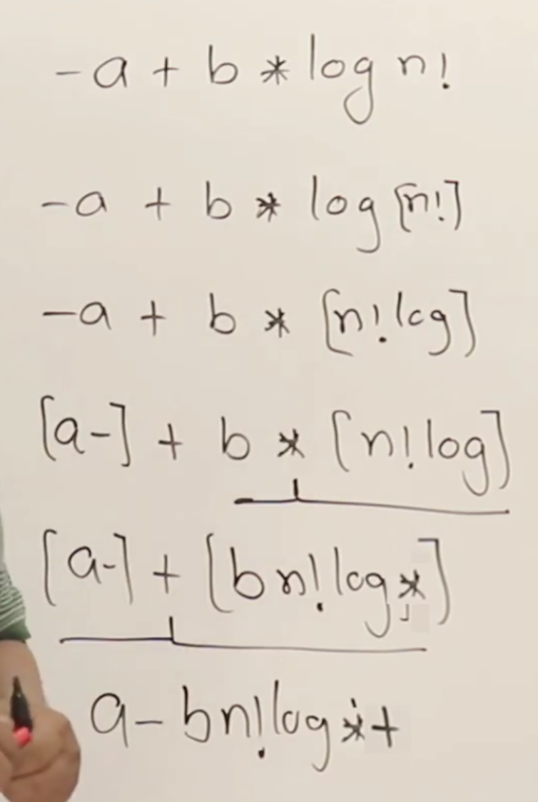
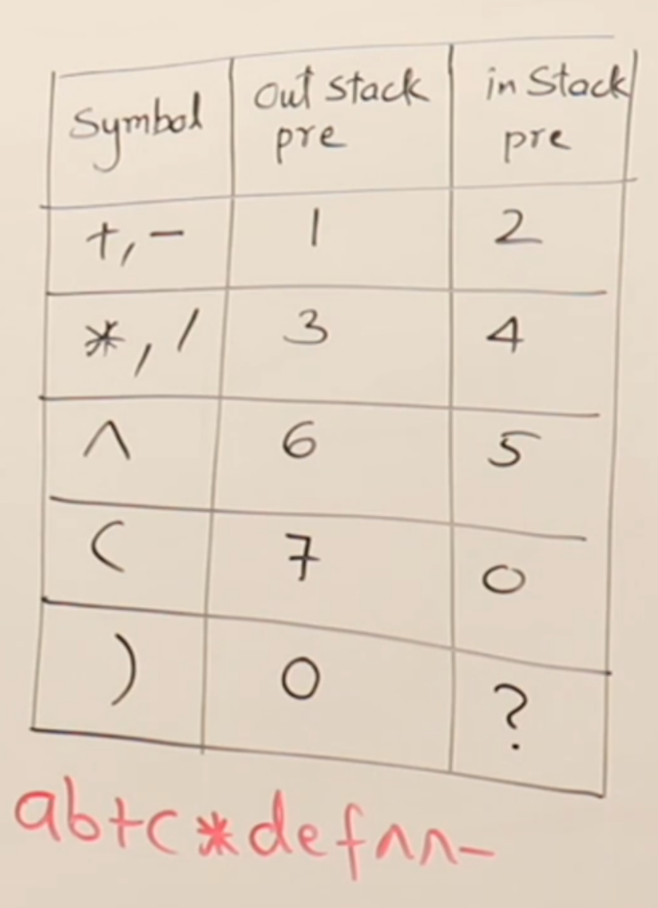

## Stack Datastructure

- Operates on the principle of last in first out (LIFO)
- Recursive functions can be converted to iterative functions and vice versa.
- In some cases, when converting recursion into iteration, we might need to declare a stack, called programmer stack.
- Abstract data type for stack contains the following core operations:
  1. push - add an element to the stack.
  2. pop - remove the top element from the stack
  3. peek(index) - see a particular element in the stack
  4. stackTop - a pointer that points to the top-most element in the stack
  5. isEmpty - boolean check for empty stack
  6. isFull - If for upper bounds for the stack


#### Lesson 232 - Stack using array

- Need an integer to store size of the stack (array).
- Need a pointer that will be stackTop.
- push and pop operations will be performed from the tail-end of the array.
- This is because inserting and deleting from tail of a static array is in O(1) time.

#### Lesson 233

- How to find the index position to return when peeking stack at a given index:

```
    index = top - position + 1

    where, top is the index position of the top element in the stack
    position is how far down the call stack you are trying to peek.
```

#### Lesson 235 - Stack using linked list

- The main goal is to perform push and pop operations in constant time.
- To do this with linked list implementation, each new element is added at the head of the linked list.
- This is the opposite of what we do in the array implementation.
- In this case, we don't need to know the size of the stack from the start as heap memory can be allocated at time of adding new element to the stack.


#### Lesson 240 - Paranthesis matching

- There are some leetcode problems based on this.
- Problem: check to see if an expression has a balanced number of paranthesis, ie, a closing bracket for every opening bracket.
- Stack data structure is used to resolve this problem.

```
Algorithm: add every opening bracket into the stack. Pop an opening bracket from the stack if a closing bracket is encountered.
Three possible scenarios:
    - Stack is empty: indicating a balanced number of parantheses
    - Opening bracket left: unbalanced with too many opening brackets.
    - Closing bracket encountered with no opening bracket in the stack: unbalanced
```
 - ASCII codes for the different brackets, for writing simpler conditionals:
 - '(' = 41
 - ')' = 42
 - '[' = 91
 - ']' = 93
 - '{' = 123
 - '}' = 125

#### Lesson 243 - Infix to Postfix Conversion

- What is postfix
- Why postfix
- Precedence
- Manual conversion

- Infix: operand - operator - operand
```
a+b
```
- Prefix: operator - operand - operand
```
+ab
```

- Postfix: operand - operand - operator
```
ab+
```

- Converting infix to postfix:
```
(a+b)*(c-d)
This mathematical formula represented as postfix would be:
ab+cd-*

This is the order in which the mathematical operation would be performed, based on precendence set by BODMAS (PEMDAS)
```

#### Lesson 244 - Associativity

- Certain mathematical operations are performed left to right, while others are performed right to left.
- The direction of operation for a mathematical operation is its associativity.
- The higher the precedence value, the earlier the operation is to be performed.
- Unary operators include arithmetic negation, ++, --, log, pointer (*), factorial (!)

| Symbol | Precedence | Associativity |
| :----: | :----: | :----: |
| +,- | 1 | L->R |
| *,/ | 2 | L->R |
| ^ | 3 | R->L |
| Unary ops | 4 | R->L |
| () | 5 | L->R |

```
The postfix for -a + b * log n!
is:
a-bn!log*+
```
Working out:



#### Lesson 247

- Algorithm for converting infix expression to postfix using a stack:
```
Create an empty string to hold characters in postfix order

Loop through the infix string.
If an operand is encountered, add directly to postfix string.
If operator is encountered, add it to the stack if stack is empty or stack_top has lower precedence.
If stack_top has higher or equal precedence to the current operator, then pop those operators from the stack first and add to postfix string.
Then add the current operator to the stack.
Once looped through the entire string, pop any remaining operators from the stack and add to the postfix string.
Add null character '\0' to string

```

#### Lesson 249

- Operator in-stack and out-stack precedences:



- If a closing brack is encountered, then operators should be popped from the stack and added to the postfix string, **except** opening bracket.

#### Lesson 250 - Evaluation of postfix expression

- The C compiler always paranthesises any mathematical expression.
```
We may write an expression as:
6 + 5 + 3 * 4

Following BODMAS (PEMDAS), we would solve 3*4 first.
But the computer actually solves 6+5 first.
The reason for this is that the compiler parenthesises the expression we give it:

((6+5) + (3*4))

By doing this, we can see why the computer solves 6+5 first, because the postfix expression is:
65+34*+
```
- To solve a postfix expression, add the operands to the stack this time.
- Once an operator is encountered in the string, pop two operands from the stack and perform the operation.
- Then add the result back into stack.
- Repeat until at the end of the string. The result of the formula will be the stack_top.
- 